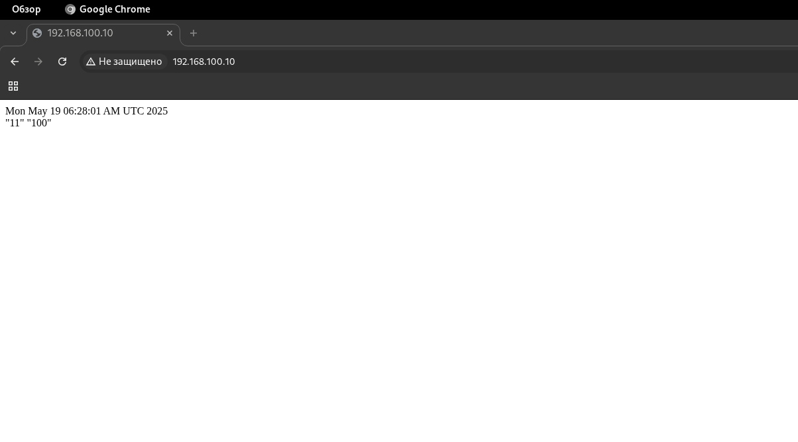

Лаб1. Скрипт запроса погоды\
Задание\
Написать bash-скрипт, который принимает в качестве входящего параметра город. 
Выводит температуру и влажность в текущий день в этом городе.\
Установить nginx.\
Скрипт запускать по крону раз в минуту, вывод сохранять в index.html дефолтного сайта.\
Необходимо использовать:\
[https://github.com/chubin/wttr.in](https://github.com/chubin/wttr.in) (json формат)\
библиотека jq для работы с json


Установка необходимых пакетов
```bash
sudo apt -y install curl nginx jq
```

Установка прав на запись для скрипта в фал web с/var/www/html/index.nginx-debian.html (права all write)
```bash
sudo chmod a+w /var/www/html/index.nginx-debian.html
```

Создание  файла скрипта, установка прав на выполнение
```bash
touch weather.sh
chmod u+x weather.sh
```

Скрипт запроса погоды
```bash
#!/usr/bin/bash 

CITY=$1

echo "<HTML><BODY>"

date
echo "<br/>"

curl -s https://wttr.in/$(CITY)?format=j1 | jq '.["current_condition"][0] | .temp_C,.humidity'

echo "</HTML></BODY>"
```

Создание cron задания
```bash
cron -e
```

Задание cron
```bash
* * * * * /home/runner/weather.sh Berlin > /var/www/html/index.nginx-debian.html 2>> /home/runner/wather.err
```

Проверка через curl
```bash
curl 127.0.0.1
```

```cmd
<HTML><BODY>
Mon May 19 06:12:01 AM UTC 2025
<br/>
"11"
"100"
</HTML></BODY>
```

Проверка в браузере

